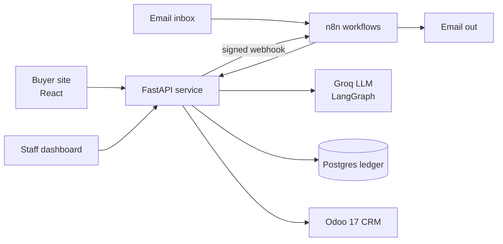

# PropFlow AI

[](https://github.com/alymaklad/PropFlow-AI/actions/workflows/ci.yml)
[](https://github.com/alymaklad/PropFlow-AI/actions/workflows/deploy.yml)

Real-estate lead automation: every inquiry from the website or email is qualified by AI,
scored by transparent rules, synced to Odoo CRM, assigned to a salesperson, answered with
matching verified listings and followed up, with a person brought in whenever the case needs
one.

**Live demo: <https://propflow-demo.duckdns.org>**

| | |
|---|---|
| Buyer site | <https://propflow-demo.duckdns.org>: browse verified listings and send an inquiry |
| Staff dashboard | <https://propflow-demo.duckdns.org/staff>: handoffs, reports, failed runs with replay (token on request) |
| Mail viewer | <https://propflow-demo.duckdns.org/mail/>: every email the system sent, including staff notifications (password on request) |

All homes, people and data are fictional. Send an inquiry with your own email address and the
reply arrives in your inbox (one email, no reminders); emails to the fictional staff are only
captured in the mail viewer. The AI runs on
a free tier, so under heavy use some inquiries are handed to a salesperson instead of being
qualified automatically (by design). A 10-minute walkthrough is in [docs/demo.md](docs/demo.md).

## What happens to an inquiry

1. **Intake.** The web form and an email inbox feed one HMAC-signed, idempotent intake
   webhook in n8n. Every event gets a correlation id in a Postgres ledger, so duplicates and
   retries never create a second lead or a second email.
2. **Qualification.** A LangGraph workflow extracts property type, location, bedrooms,
   budget, timeline and purchase intent with an LLM on Groq, in strict JSON-schema mode.
   Customer text is treated as data. Prompt injection, opt-outs and non-English messages are
   detected deterministically as a backup.
3. **Scoring.** Versioned, rule-based scoring with a per-rule explanation. The model never
   decides an action.
4. **CRM.** The lead and contact are upserted in Odoo 17 through a least-privilege custom
   module, and an owner is assigned round-robin.
5. **Response.** The customer receives a shortlist of verified listings. High-priority leads
   also alert the salesperson.
6. **Follow-up.** Up to two business-hours reminders that stop on a reply, opt-out, handoff or
   conversion.
7. **Handoff.** Requests for a person, low confidence, injection attempts or AI outages pause
   automation and give a salesperson a deadline, with escalation to the team leader.
8. **Recovery and reporting.** Failures become dead letters with one-click replay. Daily and
   weekly reports state their denominators.



## Results

Measured on synthetic data; method and limits are in
[docs/evaluation-report.md](docs/evaluation-report.md).

| Metric | Result |
|---|---|
| AI field extraction accuracy (50 labelled inquiries, 2 runs) | 98.2% to 99.3% |
| Cases needing a person that were handed off | 100% |
| Opt-outs and prompt-injection attempts detected | 100% |
| Duplicate deliveries producing one lead and one email (end-to-end scenarios) | 4/4 |
| Events recovered after a deliberate CRM outage | 2/2 |
| Automated tests | 500+ unit and integration tests, 12 end-to-end scenarios |

## Tech stack

| Area | Tools |
|---|---|
| Orchestration | n8n (5 workflows: web intake, email intake, scheduler, reports, error handler) |
| AI service | Python 3.12, FastAPI, LangGraph, Groq (`openai/gpt-oss-120b`) |
| CRM | Odoo 17 Community with a custom `propflow_crm` module (JSON-RPC, API key) |
| Data | PostgreSQL with plain SQL migrations |
| Frontend | React 19, TypeScript, Vite, served by nginx |
| Deployment | Docker Compose, Caddy (automatic HTTPS), GitHub Actions (CI, then SSH deploy and smoke test), AWS EC2 |
| Quality | pytest, ruff, gitleaks (full history), pip-audit, end-to-end scenario runner |

## Documentation

| Document | Contents |
|---|---|
| [Architecture](docs/architecture.md) | Components and 28 recorded design decisions |
| [API specification](docs/api-specification.md) | Endpoints, payloads, errors ([OpenAPI](docs/openapi.json)) |
| [Workflow catalog](docs/workflow-catalog.md) | Every n8n workflow and node |
| [Security and operations](docs/security-and-operations.md) | Trust boundaries, personal data, runbooks |
| [Evaluation report](docs/evaluation-report.md) | AI accuracy, system metrics, limitations |
| [Demo walkthrough](docs/demo.md) | 10-minute tour |
| [Deployment plan](docs/deployment-plan.md) and [guide](docs/deployment-guide.md) | Free public demo on AWS or Oracle Cloud |
| [Implementation plan](IMPLEMENTATION_PLAN.md) | Phases and status |
| [Project description](PropFlow_AI_Project_Description.md) | Original scope |

## Run it locally

Requires Docker with the Compose plugin.

```bash
cp .env.example .env        # then replace every change-me value
make up                     # build and start the stack
make odoo-init              # one-time: create the Odoo database and install CRM
make odoo-bootstrap         # integration user + API key (written into .env)
make odoo-seed              # dev: demo sales team (fictional reps + manager)
make seed-properties        # dev: synthetic property catalog
make n8n-import             # load and publish the n8n workflows
```

Details and a manual fallback: [odoo/README.md](odoo/README.md). If you just installed Docker and
get "permission denied" on the socket, log out and back in (or prefix commands with `sg docker -c`).

| Service | URL |
|---|---|
| Buyer site | http://localhost:3000 |
| Staff dashboard | http://localhost:3000/staff (sign in with `STAFF_TOKEN` from `.env`) |
| n8n | http://localhost:5678 |
| Odoo | http://localhost:8069 |
| AI service | http://localhost:8000/healthz |
| Mailpit (outgoing mail) | http://localhost:8025 |
| GreenMail (leads inbox, dev) | SMTP 127.0.0.1:3025, IMAP 127.0.0.1:3143 |

### Tests

```bash
pip install -r services/ai-qualification/requirements-dev.txt
make lint
make test                                   # migration tests skip without a database
make test-db TEST_DATABASE_URL=postgresql://postgres@localhost:5432/propflow_test
```

With the stack running and seeded (`make odoo-seed seed-properties n8n-import`):

```bash
make scenarios                      # all scenarios through the real webhook and inbox
make scenarios ARGS=--with-outage   # also stops Odoo to test dead letters and replay
```

The runner (`tests/scenarios/run_scenarios.py`, standard library only) checks the ledger,
Odoo, Mailpit and the report for each scenario. Scenarios that need the AI are skipped when
`LLM_PROVIDER` is not `groq`.

### Frontend development

`frontend/` has two surfaces: the buyer site (verified listings, a sentence that is the
search, the inquiry form) and the staff dashboard (handoffs by deadline, report figures with
denominators, failed runs with replay, latest inquiries). In the stack it is the `web` service
(nginx), which proxies only `/api/public` and `/api/staff` to the service.

```bash
npm --prefix frontend install
npm --prefix frontend run dev     # http://localhost:5173, proxies /api to localhost:8000
```

## Author

Aly Tarek Maklad ([@alymaklad](https://github.com/alymaklad))
