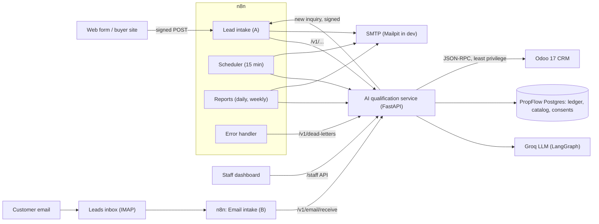

# Architecture and decisions

Scope: `PropFlow_AI_Project_Description.md`. Phasing and status: `IMPLEMENTATION_PLAN.md`.
API: `docs/api-specification.md` (machine-readable: `docs/openapi.json`). Workflows:
`docs/workflow-catalog.md`. Operations: `docs/security-and-operations.md`.

## Components

| Component | Role |
|---|---|
| **n8n** | Orchestrates every flow: webhooks, IMAP, schedules, sending email, error handling. Holds no business state. |
| **AI qualification service** | Signature checks, idempotent event ledger, normalization, LangGraph qualification, rules-based scoring, property matching, CRM upsert, routing, handoffs, reminders, templates, consent, reports, recovery. |
| **PropFlow Postgres** | Event ledger, AI traces, scores, matches, outbound-message ledger, consents, handoffs, reminder sequences, dead letters, property catalog. |
| **Odoo 17** | System of record for leads, contacts, owners, activities and notes; `propflow_crm` module adds fields, a least-privilege group and two RPC helpers. |
| **Groq** | LLM provider for extraction only (strict JSON schema). |

## Ownership rules

- **Odoo** owns leads, contacts, stages, activities and assignment.
- **PropFlow Postgres** owns everything needed to make retries safe and reports accurate.
- **n8n** owns flow, not state. Anything that must survive a retry lives in Postgres or Odoo.
- **AI output never writes to Odoo or sends messages.** The LLM code path returns validated
  JSON; scores are rule-based; n8n calls deterministic endpoints to act.

## Lead journey

1. **Receive**: signature check, record the event once (`202` straight away for a valid lead).
2. **Qualify**: AI extraction under the form fields; opt-outs stop here.
3. **Score** with versioned rules, **upsert** into Odoo (search by correlation id, then by
   contact, then create with a round-robin owner), **match** against verified listings.
4. **Next action**: hand off to the salesperson, or email a shortlist or a clarification
   question and start reminders; high-priority leads also alert the owner immediately.
5. **Later**: the scheduler sends reminders and chases overdue handoffs; replies stop reminders
   and alert the owner; daily and weekly reports go to managers.

## Decisions

| # | Decision | Why |
|---|---|---|
| 1 | LLM: Groq `openai/gpt-oss-120b` behind a provider-agnostic `LLMClient`; scripted fake for tests | Free tier, strict JSON schema (verified). Free tier: 1,000 requests/day, 8,000 tokens/minute, ~1,900 tokens per qualification. |
| 2 | Odoo Community 17.0 (Postgres 16 for its database) | Owner's choice. 17 is leaving official support: plan an upgrade before real use. |
| 3 | Odoo external API over JSON-RPC (`execute_kw`) with an API key | JSON-2 does not exist in 17. Verified live. |
| 4 | Scoring, matching and routing in the Python service, not n8n Code nodes | Unit-testable and versioned. |
| 5 | SMTP for email; Mailpit (outgoing) and GreenMail (inbox) in dev | Nothing leaves the machine in dev. |
| 6 | WhatsApp deferred; channels are web form and email | Owner's choice; enums already allow `whatsapp`. |
| 7 | Plain SQL migrations with a small runner | Immutable, checksummed, transactional, advisory-locked. |
| 8 | Docker named volumes; ports bound to 127.0.0.1 | The repo lives on an NTFS drive; no database bind mounts. |
| 9 | Synthetic data only | Project non-goal until privacy and consent are addressed. |
| 10 | English only; other languages go to a salesperson | Owner's choice; Arabic labels kept in the dataset. |
| 11 | Round-robin assignment, pointer in Postgres under a row lock | Fair; concurrent intakes never share a slot (tested). |
| 12 | Escalation is a handoff to a salesperson, not an approval queue | See below. |
| 13 | Odoo client in the service (`/v1/crm`), called by n8n | JSON-RPC errors arrive as HTTP 200; search-before-create needs tests. |
| 14 | A repeat inquiry from a known contact becomes a note and only fills missing fields | Never overwrites rep-edited values or downgrades a hot lead. |
| 15 | Webhook signatures verified in the service; unsigned requests not stored | n8n blocks `crypto`; anonymous traffic cannot fill the ledger. |
| 16 | Outbound messages at most once (claim before send) | A crash mid-send never causes a duplicate. |
| 17 | The webhook answers `202` after validation; the rest runs afterwards | Form submitters never wait on Odoo or the LLM; failures go to dead letters. |
| 18 | AI never decides alone: failure, invalid output, low confidence, injection signals or non-English input hand off | Safe default. |
| 19 | Customer-entered form fields win over AI extraction | The model only fills gaps. |
| 20 | One composite `/v1/actions/next` call after the upsert | Branching logic stays tested in Python. |
| 21 | AI failure with a location and a budget in the form continues automatically | Deterministic fallback. |
| 22 | Reminders stop on reply, opt-out, pause, handoff, conversion, win or closure | Owner keeps control. |
| 23 | Email inquiries and replays are signed by the service and sent to the same intake webhook | One intake path for every channel. |
| 24 | Replies recognised by `In-Reply-To`/`References` against the outbound ledger | Reliable; subject fallback for clients that drop headers. |
| 25 | At most 3 customer emails per address per 24 hours | Contact limit in the single customer-message path. |
| 26 | LLM calls wait out rate limits (5 attempts, Retry-After up to 20 s) | The customer already has a `202`; n8n's Qualify step allows 150 s. |
| 27 | Erasure and retention endpoints; opt-outs kept as suppression records | Data protection without losing report counts or re-contacting opted-out people. |
| 28 | Staff dashboard and buyer site call the service through a separate `/public` and `/staff` API | The webhook secret and the n8n API key never reach a browser. |

## Escalation: handoff to a salesperson

When a case needs a person, the automation does not propose an action for someone to
approve. It hands the lead to its salesperson and stops.

**Triggers:** suspected prompt injection, conflicting requirements, the customer asks for a
person, a non-English inquiry, a rental request, low AI confidence, AI unavailable or invalid
output (unless the form alone is enough), and no matching property.

**High-priority leads are not handed off.** They keep their automated shortlist or question,
and the owner gets an immediate email plus a follow-up activity due the same business day
(the description's "80-100: notify the assigned sales team promptly").

**What a handoff does:**

1. Pauses automation on the lead and stops any reminders.
2. Creates a "PropFlow handoff: contact the customer" activity for the owner (or the team
   leader if there is no owner), due in 2 business hours for high priority, otherwise the next
   business day, and posts a context note: inquiry, requirements, matches, reasons, suggested
   next step.
3. Emails the owner (a link, no action buttons) and sends the customer one acknowledgement
   naming their advisor and when to expect contact (consent-checked; never about availability
   or prices).
4. The scheduler reminds the owner once after the deadline, then emails the team leader; the
   handoff closes when the activity is marked done.

**Why not an approval queue?** It needs a review interface, expiry and double-click handling,
just to let the system send messages a salesperson would write better.

## Stack topology

`propflow-db` and `odoo-db` are separate Postgres instances. `migrate` runs before
`ai-service`. `n8n` waits for `ai-service` and `odoo`. GreenMail is the dev inbox, Mailpit the
dev outbox. The frontend (`web`) serves the buyer site and staff dashboard and proxies
`/api/public` and `/api/staff` to the service.
